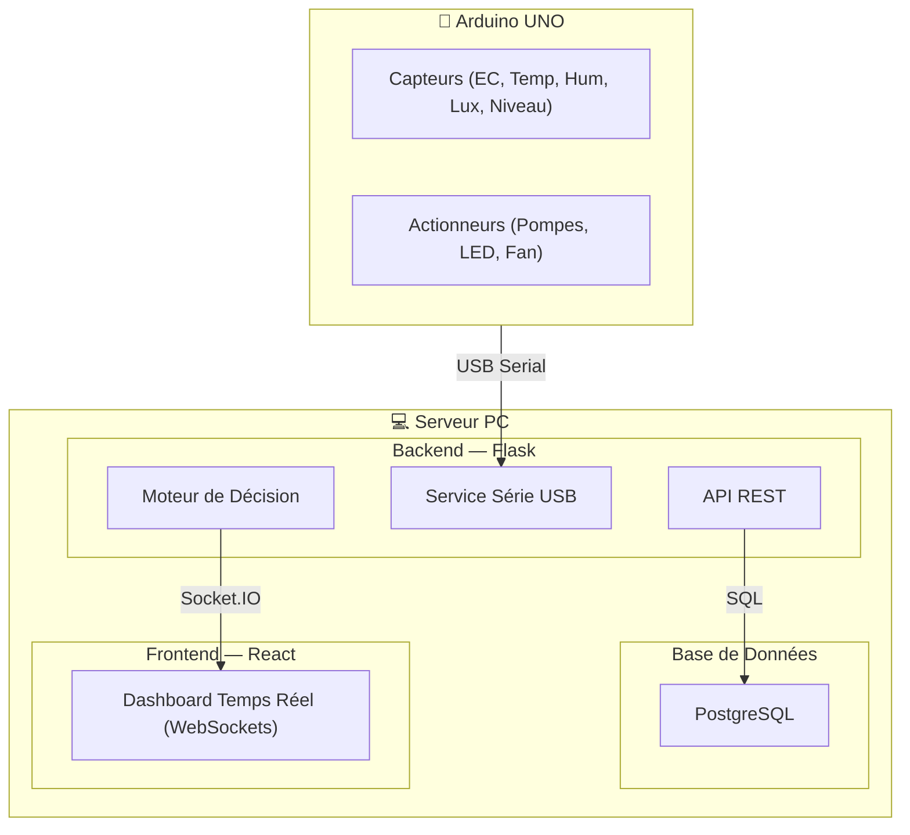

# 🌱 Serre Hydroponique Urbaine Intelligente

Système automatisé de suivi et de contrôle d'une serre hydroponique urbaine de type **Ebb & Flow** (Table à Marée). Ce projet utilise un serveur central (PC) comme cerveau décisionnel et un Arduino Uno comme interface matérielle.

---

## 📋 Table des matières
1. [Architecture](#architecture)
2. [Fonctionnalités Clés](#fonctionnalités-clés)
3. [Installation Étape par Étape](#installation-étape-par-étape)
4. [Configuration Matérielle (Arduino)](#configuration-matérielle-arduino)
5. [Guide d'Utilisation](#guide-dutilisation)
6. [Moteur de Décision (Logique Métier)](#moteur-de-décision-logique-métier)
7. [Dépannage (Troubleshooting)](#dépannage-troubleshooting)

---

## 🏗️ Architecture



---

## ✨ Fonctionnalités Clés
- **Monitoring Temps Réel** : Visualisation instantanée des constantes (EC, Température, Humidité, Luminosité, Niveau d'eau).
- **Mode Simulation Automatique** : Bascule en "Mock Mode" si l'Arduino n'est pas détecté.
- **Moteur de Décision Intelligent** : Automatisation complète de l'irrigation, de l'éclairage et de la ventilation.
- **Contrôle Manuel** : Possibilité de forcer l'état des actionneurs (Override) directement depuis l'interface.
- **Gestion des Cultures** : Système de Variétés et de Recettes (seuils personnalisables).
- **Alertes & Rapports** : Notifications par email (SMTP) et génération de rapports PDF détaillés.

---

## 🚀 Installation Étape par Étape

### 1. Prérequis
- Python 3.11+
- Node.js 18+
- PostgreSQL 16+
- Arduino IDE

### 2. Base de Données
```sql
-- Créer la base
CREATE DATABASE serre_hydroponique;
-- Importer le schéma (depuis le dossier racine)
psql -U postgres -d serre_hydroponique -f database/schema.sql
```

### 3. Backend (API)
```bash
cd backend
python -m venv venv
.\venv\Scripts\activate  # Windows
pip install -r requirements.txt

# Configurer .env (copiez .env.example)
# Éditer .env avec vos accès DB et SMTP
python seeds/seed_data.py  # Injecter les données de base
python app.py
```

### 4. Frontend (Interface)
```bash
cd frontend
npm install
npm run dev
```
Accès : `http://localhost:5173` | **Admin** : `admin@hydro.local` / `password123`

---

## 🔌 Configuration Matérielle (Arduino)

| Composant | Pin Arduino | Relais / Type |
|-----------|-------------|---------------|
| **Pompe Alimentation** | Pin 7 | Relais 1 |
| **Pompe Évacuation** | Pin 8 | Relais 2 |
| **Éclairage LED** | Pin 9 | Relais 3 |
| **Ventilateur** | Pin 10 | Relais 4 |
| **HC-SR04 (Niveau)** | Pin 2 (Trig) / 3 (Echo) | Ultrason |
| **DHT22 (Air)** | Pin 4 | Digital |
| **DS18B20 (Eau)** | Pin 5 | OneWire |
| **Capteur EC** | Pin A0 | Analogique |
| **BH1750 (Lux)** | SDA/SCL (A4/A5) | I2C |

---

## 🧠 Moteur de Décision (Logique Métier)

Le système exécute une boucle toutes les 10 secondes via `decision_engine.py` :

1. **Irrigation (Ebb & Flow)** : 
   - Si `niveau_eau <= 10cm` → **Pompe Alimentation ON**.
   - Si `niveau_eau >= 40cm` → **Pompe Évacuation ON**.
2. **Environnement** :
   - Si `temp_air > seuil_max` → **Ventilateur ON**.
   - Si `luminosite < seuil_min` → **LED ON**.
3. **Priorité Manuelle** : Toute action manuelle via le Dashboard désactive l'automatisme pour l'appareil concerné jusqu'au retour en mode "Auto".

---

## 🛠️ Dépannage (Troubleshooting)

- **Arduino non détecté** : Vérifiez le `SERIAL_PORT` dans `backend/.env`.
- **Socket.IO déconnecté** : Assurez-vous que le backend tourne sur le port `5000`.
- **Emails non envoyés** : Utilisez un "Mot de passe d'application" pour Gmail.

---
**Équipe** : Projet réalisé dans le cadre du cours Arduino — LSI 1ère année 2025/2026.  
**Licence** : Usage éducatif uniquement.