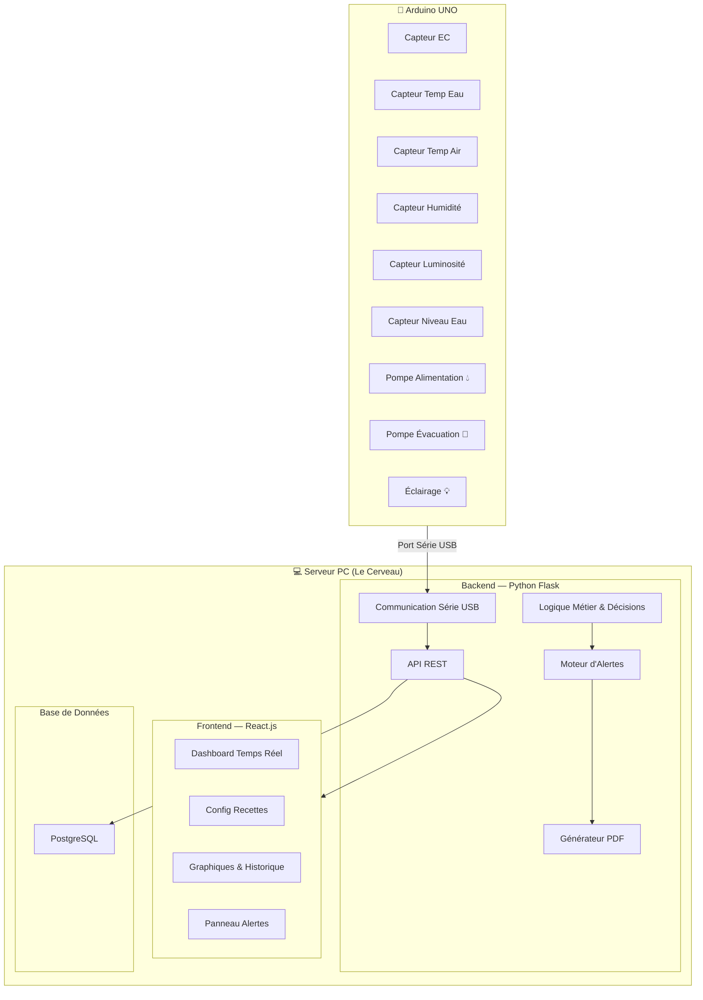
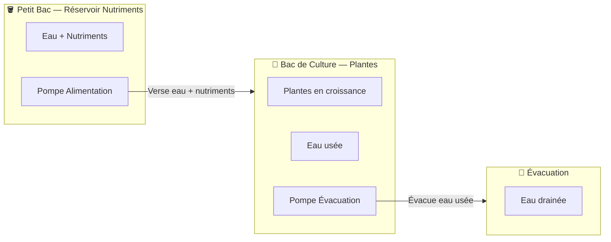
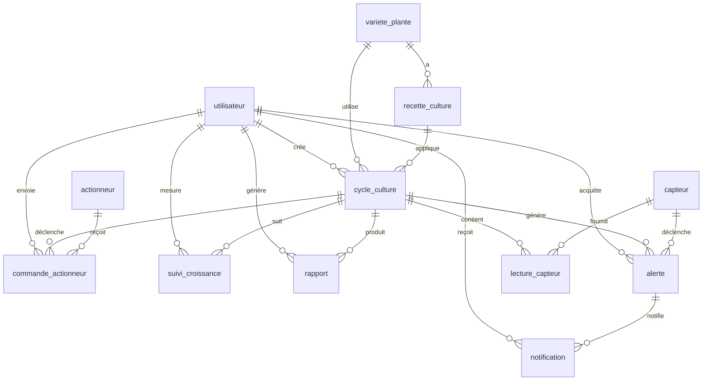

# 🌱 Serre Hydroponique Urbaine Intelligente — Plan d'Implémentation

## Vue d'ensemble

**Projet** : Automatiser le suivi et le contrôle des paramètres d'une serre hydroponique urbaine.  
**Deadline** : 10 mai 2026 | **Démo** : 12 mai 2026 (8–10 min + 5 min Q&A)  
**Équipe** : 5 personnes  
**Branche active** : `dev_test` (créée depuis `main`)

---

## Architecture Globale



---

## Système Hydraulique — Ebb & Flow (Marée et Reflux)



**Fonctionnement** :
1. Le **réservoir** (petit bac) contient l'eau enrichie en nutriments
2. La **Pompe Alimentation** verse cette eau dans le **bac de culture** où poussent les plantes
3. La **Pompe Évacuation** draine l'eau usée du bac de culture
4. Les deux pompes fonctionnent **en coordination** : quand la pompe d'alimentation remplit, la pompe d'évacuation draine simultanément
5. Toute décision d'activation est prise par le **serveur** (jamais l'Arduino seul)

---

## Stack Technique

| Couche | Technologie | Justification |
|--------|------------|---------------|
| **Backend** | Python 3.11+ / Flask | Imposé par le cahier des charges |
| **Base de données** | PostgreSQL 16 | Imposé (robustesse, JSONB, types riches) |
| **ORM** | SQLAlchemy + Flask-Migrate (Alembic) | Migrations versionnées, modèles Python |
| **API** | Flask-RESTful ou Flask blueprints | API REST claire et modulaire |
| **Auth** | Flask-JWT-Extended | Tokens JWT pour admin/opérateur |
| **Serial** | PySerial | Communication Arduino ↔ PC |
| **Frontend** | React.js 18 (Vite) | Imposé, SPA rapide |
| **Charts** | Recharts ou Chart.js | Graphiques temps réel |
| **WebSocket** | Flask-SocketIO + socket.io-client | Push des données en temps réel |
| **PDF** | ReportLab ou WeasyPrint | Génération automatique de rapports |
| **Notifications** | smtplib (email) / Twilio (SMS) | Bonus : alertes multicanal |
| **Arduino** | Arduino IDE / C++ | Lecture capteurs, commande actionneurs |

---

## Structure du Projet (Cible)

```
hydroponic-greenhouse/
├── .gitignore
├── README.md
├── arduino/
│   └── main.ino
├── backend/
│   ├── .env.example
│   ├── .env                          # (gitignored)
│   ├── requirements.txt
│   ├── app.py                        # Point d'entrée Flask
│   ├── config.py                     # Configuration (DB, JWT, Serial...)
│   ├── extensions.py                 # Init SQLAlchemy, Migrate, JWT, SocketIO
│   ├── models/
│   │   ├── __init__.py
│   │   ├── utilisateur.py
│   │   ├── variete_plante.py
│   │   ├── recette_culture.py
│   │   ├── cycle_culture.py
│   │   ├── capteur.py
│   │   ├── lecture_capteur.py
│   │   ├── actionneur.py
│   │   ├── commande_actionneur.py
│   │   ├── alerte.py
│   │   ├── notification.py
│   │   ├── suivi_croissance.py
│   │   └── rapport.py
│   ├── routes/
│   │   ├── __init__.py
│   │   ├── auth.py                   # Login / Register / JWT
│   │   ├── utilisateurs.py
│   │   ├── varietes.py
│   │   ├── recettes.py
│   │   ├── cycles.py
│   │   ├── capteurs.py
│   │   ├── lectures.py
│   │   ├── actionneurs.py
│   │   ├── commandes.py
│   │   ├── alertes.py
│   │   ├── notifications.py
│   │   ├── suivi.py
│   │   └── rapports.py
│   ├── services/
│   │   ├── __init__.py
│   │   ├── serial_service.py         # Lecture série USB
│   │   ├── decision_engine.py        # Logique métier (irrigation, éclairage)
│   │   ├── alert_service.py          # Détection dérives + création alertes
│   │   ├── notification_service.py   # Email / SMS
│   │   ├── pdf_service.py            # Génération rapports PDF
│   │   └── prediction_service.py     # Bonus: prédiction récolte
│   ├── migrations/                   # Flask-Migrate (Alembic)
│   ├── seeds/
│   │   └── seed_data.py              # Données initiales (capteurs, variétés...)
│   └── tests/
│       ├── __init__.py
│       ├── test_auth.py
│       ├── test_cycles.py
│       ├── test_decision_engine.py
│       └── test_alerts.py
├── database/
│   ├── schema.sql                    # Script SQL de création (depuis serre_hydroponique.sql)
│   └── seed.sql                      # Données de démo
├── frontend/
│   ├── package.json
│   ├── vite.config.js
│   ├── index.html
│   ├── public/
│   └── src/
│       ├── main.jsx
│       ├── App.jsx
│       ├── App.css
│       ├── api/
│       │   └── client.js             # Axios instance + intercepteurs JWT
│       ├── context/
│       │   └── AuthContext.jsx
│       ├── components/
│       │   ├── Layout/
│       │   │   ├── Sidebar.jsx
│       │   │   ├── Header.jsx
│       │   │   └── Layout.jsx
│       │   ├── Dashboard/
│       │   │   ├── SensorCard.jsx
│       │   │   ├── ActuatorControl.jsx
│       │   │   ├── AlertBanner.jsx
│       │   │   └── LiveChart.jsx
│       │   ├── Cycles/
│       │   │   ├── CycleList.jsx
│       │   │   ├── CycleForm.jsx
│       │   │   └── CycleDetail.jsx
│       │   ├── Recettes/
│       │   │   ├── RecetteList.jsx
│       │   │   └── RecetteForm.jsx
│       │   ├── Suivi/
│       │   │   ├── GrowthTracker.jsx
│       │   │   └── GrowthChart.jsx
│       │   ├── Alertes/
│       │   │   ├── AlertList.jsx
│       │   │   └── AlertDetail.jsx
│       │   └── Rapports/
│       │       ├── ReportList.jsx
│       │       └── ReportViewer.jsx
│       └── pages/
│           ├── LoginPage.jsx
│           ├── DashboardPage.jsx
│           ├── CyclesPage.jsx
│           ├── RecettesPage.jsx
│           ├── SuiviPage.jsx
│           ├── AlertesPage.jsx
│           ├── RapportsPage.jsx
│           └── SettingsPage.jsx
└── docs/
    ├── architecture.png              # Diagramme d'architecture
    ├── erd.png                       # Diagramme ERD
    └── scenarios_test.md             # Tableau des scénarios de test
```

---

## Base de Données — Modèle ERD

Le schéma SQL fourni (`serre_hydroponique.sql`) définit **11 tables** avec les relations suivantes :



> [!IMPORTANT]
> Le cahier des charges mentionne **PostgreSQL** (ligne 7) mais aussi **MySQL** (ligne 24). On suit PostgreSQL car c'est la contrainte obligatoire explicite.

---

## Plan de Sprints Détaillé

### 🟢 Sprint 1 — Semaine 1 (24–30 avril) : Fondations

> Focus : Setup projet, DB, Backend core, Frontend skeleton

#### Backend
- [ ] Setup Flask project structure (config, extensions, blueprints)
- [ ] Écrire tous les **modèles SQLAlchemy** (11 tables)
- [ ] Configurer **Flask-Migrate** et générer la migration initiale
- [ ] Implémenter l'**authentification** (register, login, JWT)
- [ ] CRUD **Variétés de plantes** (routes + tests)
- [ ] CRUD **Recettes de culture** (routes + tests)
- [ ] CRUD **Capteurs** (routes + tests)
- [ ] CRUD **Actionneurs** (routes + tests)
- [ ] Script de **seed data** (variétés, capteurs, actionneurs par défaut)

#### Frontend
- [ ] Init projet React avec **Vite**
- [ ] Setup structure (pages, components, api, context)
- [ ] Implémenter le **système d'auth** (login, contexte JWT, routes protégées)
- [ ] Layout principal : **Sidebar + Header + routing**
- [ ] Design system : variables CSS, composants de base (Card, Button, Input, Table)

#### Infra
- [ ] Écrire le **.gitignore** complet
- [ ] Écrire le **README.md** professionnel
- [ ] Copier le schéma SQL dans `database/schema.sql`
- [ ] Tester la connexion PostgreSQL

---

### 🟡 Sprint 2 — Semaine 2 (1–7 mai) : Logique Métier & Temps Réel

> Focus : Communication série, décisions automatiques, dashboard live

#### Backend
- [ ] CRUD **Cycles de culture** (création, démarrage, clôture)
- [ ] Service **serial_service.py** : lecture port série USB (PySerial)
- [ ] Service **decision_engine.py** : comparaison lectures vs recette active
  - Si niveau eau bas dans le bac → **pompe alimentation ON** (verse nutriments depuis le réservoir)
  - Quand pompe alimentation ON → **pompe évacuation ON** simultanément (draine l'eau usée)
  - Si EC trop basse → ajuster cycle d'irrigation (plus de nutriments)
  - Si luminosité insuffisante → **éclairage ON**
  - Toute décision = écriture dans `commande_actionneur`
  - Les deux pompes fonctionnent toujours **en paire** (flood & drain)
- [ ] Endpoint **POST /api/lectures** : réception manuelle ou batch de lectures
- [ ] Setup **Flask-SocketIO** : push des lectures en temps réel
- [ ] CRUD **Commandes actionneurs** (historique, commande manuelle)

#### Frontend
- [ ] **DashboardPage** : cartes capteurs avec valeurs temps réel (WebSocket)
- [ ] **LiveChart** : graphique temps réel des 6 paramètres
- [ ] **ActuatorControl** : boutons ON/OFF manuels pour chaque actionneur
- [ ] **CyclesPage** : liste des cycles, formulaire de création
- [ ] **RecettesPage** : configuration des recettes par variété

---

### 🔴 Sprint 3 — Semaine 3 (8–9 mai) : Alertes, Suivi & Bonus

> Focus : Alertes, notifications, suivi de croissance, rapports PDF

#### Backend
- [ ] Service **alert_service.py** : détection automatique des dérives
  - Comparaison `lecture_capteur.valeur` vs `recette_culture.{param}_min/max`
  - Création d'alertes avec sévérité (info, warning, critique)
- [ ] CRUD **Alertes** (liste, acquittement, filtres)
- [ ] Service **notification_service.py** : envoi email (smtplib) + SMS optionnel
- [ ] CRUD **Suivi de croissance** (hauteur, poids, observations, photo)
- [ ] Service **pdf_service.py** : génération rapport PDF (ReportLab)
  - Rapport de rendement, de croissance, résumé de cycle
- [ ] CRUD **Rapports** (génération, téléchargement)
- [ ] **Bonus** : `prediction_service.py` — prédiction date de récolte (régression linéaire simple sur le suivi de croissance)

#### Frontend
- [ ] **AlertesPage** : liste d'alertes avec filtres (sévérité, acquittées/non)
- [ ] **AlertBanner** : notification toast temps réel sur le dashboard
- [ ] **SuiviPage** : formulaire de suivi + graphique de croissance
- [ ] **RapportsPage** : liste des rapports, bouton générer, viewer PDF
- [ ] **SettingsPage** : gestion profil, paramètres de notification

---

### 🏁 Sprint 4 — Semaine 4 (10–12 mai) : Tests, Polish & Démo

> Focus : Tests d'intégration, scénarios de test, rapport technique, démo

- [ ] Écrire **10 scénarios de test** documentés (cas nominaux + cas limites)
- [ ] Tests d'intégration backend (pytest)
- [ ] Test de bout en bout : capteur → backend → décision → actionneur
- [ ] Polish UI : animations, responsive, dark mode
- [ ] Préparer le **rapport technique PDF** (cf. livrables)
- [ ] Préparer la **présentation de démo** (8–10 min)
- [ ] Générer le **diagramme d'architecture** et le **diagramme ERD** finaux
- [ ] Packager le projet en `.zip` : `Groupe5_SerreHydroponique.zip`

---

## Répartition de l'Équipe (5 personnes)

| Membre | Rôle principal | Responsabilités |
|--------|---------------|-----------------|
| **Dev 1** | Backend Lead | Flask setup, modèles, migrations, auth, API CRUD |
| **Dev 2** | Backend Logic | serial_service, decision_engine, alert_service, WebSocket |
| **Dev 3** | Frontend Lead | React setup, layout, dashboard, charts temps réel |
| **Dev 4** | Frontend Features | Pages (cycles, recettes, suivi, alertes, rapports) |
| **Dev 5** | Full-stack + Intégration | PDF, notifications, tests, seed data, docs, Arduino prep |

> [!TIP]
> Chaque dev travaille sur sa propre branche (`feature/xxx`) et merge vers `dev_test`. On merge `dev_test` → `main` uniquement quand c'est stable.

---

## Stratégie Git

```
main ← dev_test ← feature/auth
                 ← feature/models
                 ← feature/dashboard
                 ← feature/serial
                 ← feature/alerts
                 ← ...
```

**Convention de commits** : `type(scope): message`
- `feat(backend): add user authentication`
- `fix(frontend): correct chart rendering`
- `docs: update README with install instructions`

---

## API REST — Endpoints Principaux

| Méthode | Endpoint | Description |
|---------|----------|-------------|
| `POST` | `/api/auth/register` | Inscription utilisateur |
| `POST` | `/api/auth/login` | Connexion → JWT |
| `GET` | `/api/varietes` | Lister les variétés |
| `POST` | `/api/varietes` | Créer une variété |
| `GET/POST` | `/api/recettes` | CRUD recettes de culture |
| `GET/POST` | `/api/cycles` | CRUD cycles de culture |
| `PATCH` | `/api/cycles/:id/terminer` | Terminer un cycle |
| `GET` | `/api/capteurs` | Lister les capteurs |
| `POST` | `/api/lectures` | Enregistrer des lectures |
| `GET` | `/api/lectures?cycle_id=X` | Historique lectures par cycle |
| `GET` | `/api/actionneurs` | Lister les actionneurs |
| `POST` | `/api/commandes` | Envoyer commande manuelle |
| `GET` | `/api/alertes` | Lister les alertes |
| `PATCH` | `/api/alertes/:id/acquitter` | Acquitter une alerte |
| `GET/POST` | `/api/suivi` | CRUD suivi de croissance |
| `POST` | `/api/rapports/generer` | Générer un rapport PDF |
| `GET` | `/api/rapports/:id/download` | Télécharger un rapport |

---

## User Review Required

> [!IMPORTANT]
> **Choix de la DB** : Le projet mentionne PostgreSQL (règle obligatoire) ET MySQL (architecture commune). Je pars sur **PostgreSQL** — confirmez-vous ?

> [!IMPORTANT]
> **Notifications SMS** : Twilio nécessite un compte payant. Voulez-vous implémenter uniquement **email** pour le bonus, ou avez-vous un compte Twilio ?

> [!WARNING]
> **Communication série** : Sans l'Arduino physique pour l'instant, je propose de créer un **simulateur série** (`serial_simulator.py`) qui envoie des données factices au backend via un port série virtuel. Cela permet de tester toute la stack sans matériel. OK ?

---

## Open Questions

1. **Avez-vous déjà PostgreSQL installé** sur vos machines, ou faut-il un `docker-compose.yml` pour la DB ?
2. **Quels sont les noms des 5 membres** pour personnaliser la répartition des tâches ?
3. **Avez-vous un serveur SMTP** (Gmail, Outlook...) pour les notifications email ?
4. **Quelle version de Node.js** avez-vous installée ? (pour le frontend React/Vite)
5. **Préférez-vous Recharts ou Chart.js** pour les graphiques ?

---

## 🛠️ Skills Antigravity Pertinentes

Voici les skills que j'ai à disposition et qui sont **directement utiles** pour ce projet :

### Backend & API
| Skill | Utilité |
|-------|---------|
| `backend-architect` | Architecture backend scalable, API design |
| `api-patterns` | REST API design, response formats, pagination |
| `api-documentation` | Documentation auto des endpoints |
| `database` | SQL, design, migrations, optimisation |
| `database-design` | Schema design, indexing, ORM |
| `postgresql` | Types, index, contraintes, performance PostgreSQL |
| `python-pro` | Patterns Python avancés |

### Frontend & UI
| Skill | Utilité |
|-------|---------|
| `react-patterns` | Hooks, composition, performance React |
| `frontend-design` | Design frontend premium |
| `design-spells` | Micro-interactions, animations magiques |
| `claude-d3js-skill` | Visualisations de données (si D3 choisi) |
| `ui-ux-designer` | Design system, accessibilité |

### DevOps & Qualité
| Skill | Utilité |
|-------|---------|
| `git-pr-workflows` | Workflow Git, branches, PRs |
| `testing-qa` | Unit tests, intégration, E2E |
| `tdd-workflow` | Test-Driven Development |
| `documentation` | README, docs techniques |
| `lint-and-validate` | Validation code après chaque changement |

### Spécialisées
| Skill | Utilité |
|-------|---------|
| `webapp-testing` | Tests d'application web (Playwright) |
| `mermaid-expert` | Diagrammes architecture et ERD |
| `powershell-windows` | Scripts Windows pour le setup |
| `debugger` | Debugging des erreurs |

---

## Proposed Changes — Phase Immédiate (Aujourd'hui)

### [MODIFY] [.gitignore](file:///c:/Users/My%20ThinkBook/OneDrive/Desktop/hydroponic-greenhouse/hydroponic-greenhouse/.gitignore)
Remplir avec un `.gitignore` complet couvrant Python, Node.js, IDEs, env files, et fichiers OS.

### [MODIFY] [README.md](file:///c:/Users/My%20ThinkBook/OneDrive/Desktop/hydroponic-greenhouse/hydroponic-greenhouse/README.md)
Écrire un README professionnel avec : description, architecture, prérequis, installation backend/frontend, utilisation, structure du projet, équipe, licence.

### [MODIFY] [schema.sql](file:///c:/Users/My%20ThinkBook/OneDrive/Desktop/hydroponic-greenhouse/hydroponic-greenhouse/database/schema.sql)
Copier le contenu de `serre_hydroponique.sql` dans `database/schema.sql`.

### [MODIFY] [.env.example](file:///c:/Users/My%20ThinkBook/OneDrive/Desktop/hydroponic-greenhouse/hydroponic-greenhouse/backend/.env.example)
Remplir avec les variables d'environnement nécessaires (DB URL, JWT secret, serial port...).

---

## Verification Plan

### Automated Tests
- `pytest` pour tous les endpoints backend
- Tests unitaires du `decision_engine` et `alert_service`
- Linting : `flake8` (Python) + `eslint` (React)

### Manual Verification
- Tester le workflow complet : lecture capteur → décision → commande actionneur
- Vérifier le dashboard temps réel avec des données simulées
- Générer un rapport PDF et vérifier le contenu
- Tester les alertes et notifications email
